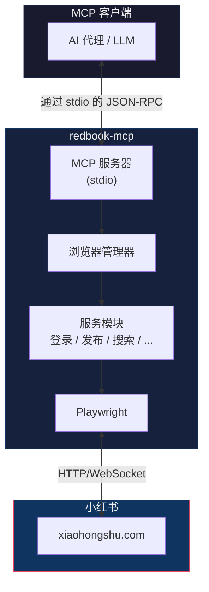

# 小红书 MCP

## 介绍

一个基于 [Playwright](https://playwright.dev) 的 [Model Context Protocol (MCP)](https://modelcontextprotocol.io) 服务器，为 [小红书](https://www.xiaohongshu.com) 提供自动化能力。该服务器使 LLM 能够通过浏览器自动化与小红书交互，支持内容发布、搜索、评论等功能。

## 主要特性

- **内容发布**。支持发布图文和视频内容，支持定时发布
- **内容发现**。搜索和浏览动态流，获取帖子详情，探索用户主页
- **社交互动**。点赞、收藏、评论和回复帖子
- **登录管理**。基于二维码的登录方式，支持持久化会话存储
- **LLM 友好**。结构化的工具接口，便于与 AI 代理集成

## 系统要求

- Node.js 18 或更高版本
- VS Code、Cursor、Windsurf、Claude Desktop、Goose 或其他 MCP 客户端
- Playwright Chromium 浏览器（首次运行时自动安装）

## 快速开始

首先，在你的客户端中安装小红书 MCP 服务器。

**标准配置**适用于大多数工具：

```js
{
  "mcpServers": {
    "xiaohongshu": {
      "command": "npx",
      "args": [
        "redbook-mcp@latest"
      ]
    }
  }
}
```

<details>
<summary>Claude Desktop</summary>

按照 MCP 安装[指南](https://modelcontextprotocol.io/quickstart/user)，使用上面的标准配置。

</details>

<details>
<summary>Cursor</summary>

#### 点击按钮安装：

[](https://cursor.com/en/install-mcp?name=Xiaohongshu&config=eyJjb21tYW5kIjoibnB4IiwgImFyZ3MiOlsicjedGJvb2stbWNwQGxhdGVzdCJdfQ%3D%3D)

#### 或手动安装：

进入 `Cursor Settings` -> `MCP` -> `Add new MCP Server`。自定义名称，使用 `command` 类型，命令为 `npx redbook-mcp@latest`。你也可以通过点击 `Edit` 来验证配置或添加命令参数。

</details>

<details>
<summary>VS Code</summary>

#### 点击按钮安装：

[](https://insiders.vscode.dev/redirect?url=vscode%3Amcp%2Finstall%3F%257B%2522name%2522%253A%2522xiaohongshu%2522%252C%2522command%2522%253A%2522npx%2522%252C%2522args%2522%253A%255B%2522redbook-mcp%2540latest%2522%255D%257D) [](https://insiders.vscode.dev/redirect?url=vscode-insiders%3Amcp%2Finstall%3F%257B%2522name%2522%253A%2522xiaohongshu%2522%252C%2522command%2522%253A%2522npx%2522%252C%2522args%2522%253A%255B%2522redbook-mcp%2540latest%2522%255D%257D)

#### 或手动安装：

按照 MCP 安装[指南](https://code.visualstudio.com/docs/copilot/chat/mcp-servers#_add-an-mcp-server)，使用上面的标准配置。

</details>

<details>
<summary>Windsurf</summary>

按照 Windsurf MCP [文档](https://docs.windsurf.com/windsurf/cascade/mcp)。使用上面的标准配置。

</details>

<details>
<summary>Goose</summary>

#### 点击按钮安装：

[](https://block.github.io/goose/extension?cmd=npx&arg=redbook-mcp%40latest&id=xiaohongshu&name=Xiaohongshu&description=Automate%20Xiaohongshu%20through%20browser%20automation%20using%20Playwright)

#### 或手动安装：

进入 `Advanced settings` -> `Extensions` -> `Add custom extension`。自定义名称，使用类型 `STDIO`，并将 `command` 设置为 `npx redbook-mcp@latest`。点击 "Add Extension"。


</details>

## CLI 使用

除了作为 MCP 服务器运行外，redbook-mcp 还支持命令行交互（CLI）模式。
你可以在本地直接运行命令进行交互。

### 常用命令

#### 登录
启动交互式登录流程（会打开浏览器窗口显示二维码）：
```bash
npx redbook-mcp login
```

#### 搜索
搜索小红书内容：
```bash
npx redbook-mcp search "搜索关键词"
```

#### 获取详情
获取指定笔记详情：
```bash
npx redbook-mcp detail <feed_id> --token <xsec_token>
```

## 配置选项

小红书 MCP 服务器支持以下参数。可以在上面的 JSON 配置中作为 `"args"` 列表的一部分提供：

| 选项 | 说明 | 默认值 |
|------|------|--------|
| `--headless` | 以无头模式运行浏览器 | `true` |
| `--dataDir <path>` | 运行时数据目录（截图、下载等） | `~/.redbook-mcp` |
| `--storagePath <path>` | 登录会话的 storageState.json 文件路径 | `{dataDir}/storageState.json` |
| `--chromePath <path>` | Chrome/Chromium 可执行文件路径（可选） | 自动检测 |

**环境变量：**

你也可以使用环境变量来配置服务器：

| 环境变量 | 说明 |
|---------|------|
| `XHS_HEADLESS` | 设置为 `false` 以有头模式运行 |
| `XHS_DATA_DIR` | 覆盖数据目录路径 |
| `XHS_STORAGE_PATH` | 覆盖存储状态文件路径 |
| `XHS_CHROME_PATH` | 覆盖 Chrome 可执行文件路径 |

**配置示例：**

```js
{
  "mcpServers": {
    "xiaohongshu": {
      "command": "npx",
      "args": [
        "redbook-mcp@latest",
        "--headless",
        "false",
        "--dataDir",
        "/custom/data/path"
      ]
    }
  }
}
```

## 用户配置和会话管理

服务器使用持久化的浏览器配置文件来维护登录会话。所有登录信息都存储在存储状态文件中，在会话之间保持持久化。

**默认存储位置：**

```bash
# Windows
%USERPROFILE%\.redbook-mcp\storageState.json

# macOS / Linux
~/.redbook-mcp/storageState.json
```

你可以删除存储状态文件来重置登录会话。服务器会在下次需要身份验证的操作时提示你重新登录。

## 工具列表

### 身份验证

<details>
<summary><b>登录管理</b></summary>

- **check_login_status**
  - 标题：检查登录状态
  - 说明：检查用户是否已登录小红书
  - 参数：无
  - 只读：**true**

- **get_login_qrcode**
  - 标题：获取登录二维码
  - 说明：获取用于登录小红书的二维码。返回 Base64 编码的 PNG 图片
  - 参数：无
  - 只读：**true**

- **delete_cookies**
  - 标题：删除 Cookies
  - 说明：删除 cookies 文件以重置登录状态。删除后，你需要重新登录
  - 参数：无
  - 只读：**false**（破坏性操作）

</details>

### 内容发布

<details>
<summary><b>发布工具</b></summary>

- **publish_content**
  - 标题：发布内容
  - 说明：发布图文内容到小红书
  - 参数：
    - `title` (string)：内容标题（最多 20 个中文字或英文单词）
    - `content` (string)：正文内容（最多 1000 个字符，不包含话题标签）
    - `images` (array)：图片路径 - 支持 HTTP/HTTPS URL（自动下载）或本地绝对路径
    - `tags` (array, 可选)：话题标签列表，例如：["美食", "旅行", "生活"]
    - `schedule_at` (string, 可选)：定时发布时间，ISO8601 格式（例如："2024-01-20T10:30:00+08:00"），支持 1 小时至 14 天内
  - 只读：**false**（破坏性操作）

- **publish_with_video**
  - 标题：发布视频
  - 说明：发布视频内容到小红书（仅支持本地视频文件）
  - 参数：
    - `title` (string)：内容标题（最多 20 个中文字或英文单词）
    - `content` (string)：正文内容（最多 1000 个字符）
    - `video` (string)：本地视频文件绝对路径
    - `tags` (array, 可选)：话题标签列表
    - `schedule_at` (string, 可选)：定时发布时间，ISO8601 格式
  - 只读：**false**（破坏性操作）

</details>

### 内容发现

<details>
<summary><b>内容浏览</b></summary>

- **list_feeds**
  - 标题：获取动态流
  - 说明：获取首页动态流列表
  - 参数：无
  - 只读：**true**

- **search_feeds**
  - 标题：搜索内容
  - 说明：在小红书上搜索内容（需要登录）
  - 参数：
    - `keyword` (string)：搜索关键词
    - `filters` (object, 可选)：筛选选项
      - `sort_by` (enum, 可选)：排序方式 - "综合", "最新", "最多点赞", "最多评论", "最多收藏"
      - `note_type` (enum, 可选)：内容类型 - "不限", "视频", "图文"
      - `publish_time` (enum, 可选)：发布时间范围 - "不限", "一天内", "一周内", "半年内"
      - `search_scope` (enum, 可选)：搜索范围 - "不限", "已看过", "未看过", "已关注"
      - `location` (enum, 可选)：位置筛选 - "不限", "同城", "附近"
  - 只读：**true**

- **get_specified_post**
  - 标题：获取指定帖子
  - 说明：获取符合搜索条件的指定数量的帖子。返回帖子详情、作者信息、互动数据和评论。需要登录。
  - 参数：
    - `keyword` (string)：搜索关键词
    - `post_count` (number)：要获取的帖子数量
    - `filters` (object, 可选)：与 `search_feeds` 相同的筛选选项
  - 只读：**true**

- **get_feed_detail**
  - 标题：获取帖子详情
  - 说明：获取特定帖子的详细信息，包括内容、图片、作者信息、互动数据和评论。默认返回前 10 条一级评论。设置 `load_all_comments=true` 可获取更多评论。
  - 参数：
    - `feed_id` (string)：从动态流列表获取的帖子 ID
    - `xsec_token` (string)：从动态流列表的 xsecToken 字段获取的访问令牌
    - `load_all_comments` (boolean, 可选)：是否加载全部评论
    - `comment_config` (object, 可选)：评论加载配置
      - `click_more_replies` (boolean, 可选)：是否点击"更多回复"按钮
      - `max_replies_threshold` (number, 可选)：最大回复阈值
      - `max_comment_items` (number, 可选)：要加载的最大评论数量
      - `scroll_speed` (enum, 可选)：滚动速度 - "slow", "normal", "fast"
  - 只读：**true**

- **user_profile**
  - 标题：用户主页
  - 说明：获取用户主页信息，包括基本信息、关注/粉丝/获赞量及其发布的帖子
  - 参数：
    - `user_id` (string)：从动态流列表获取的用户 ID
    - `xsec_token` (string)：从动态流列表的 xsecToken 字段获取的访问令牌
  - 只读：**true**

</details>

### 社交互动

<details>
<summary><b>互动工具</b></summary>

- **post_comment_to_feed**
  - 标题：发表评论
  - 说明：在小红书帖子上发表评论
  - 参数：
    - `feed_id` (string)：帖子 ID
    - `xsec_token` (string)：访问令牌
    - `content` (string)：评论内容
  - 只读：**false**（破坏性操作）

- **reply_comment_in_feed**
  - 标题：回复评论
  - 说明：回复帖子下的特定评论
  - 参数：
    - `feed_id` (string)：帖子 ID
    - `xsec_token` (string)：访问令牌
    - `comment_id` (string, 可选)：要回复的评论 ID
    - `user_id` (string, 可选)：要回复的用户 ID（comment_id 的替代方案）
    - `content` (string)：回复内容
  - 只读：**false**（破坏性操作）

- **like_feed**
  - 标题：点赞帖子
  - 说明：点赞或取消点赞帖子（如果已经是期望状态则跳过）
  - 参数：
    - `feed_id` (string)：帖子 ID
    - `xsec_token` (string)：访问令牌
    - `unlike` (boolean, 可选)：是否取消点赞（默认为 false，表示点赞）
  - 只读：**false**（破坏性操作）

- **favorite_feed**
  - 标题：收藏帖子
  - 说明：收藏或取消收藏帖子（如果已经是期望状态则跳过）
  - 参数：
    - `feed_id` (string)：帖子 ID
    - `xsec_token` (string)：访问令牌
    - `unfavorite` (boolean, 可选)：是否取消收藏（默认为 false，表示收藏）
  - 只读：**false**（破坏性操作）

</details>

## 架构概览



## 项目结构

```
src/
├── cli.ts                 # CLI 入口点
├── index.ts               # 包导出入口
├── lib/                   # 通用工具库
│   ├── config.ts          # 配置定义
│   ├── fs.ts              # 文件系统工具
│   └── mutex.ts           # 互斥锁
├── mcp/
│   └── server.ts          # MCP 服务器实现
├── storage/
│   └── storageStateStore.ts  # 登录状态存储
├── utils/
│   └── imageResolver.ts   # 图片处理工具
└── xhs/                   # 小红书业务模块
    ├── browserManager.ts  # 浏览器管理
    ├── comment.ts         # 评论服务
    ├── feedDetail.ts      # 帖子详情服务
    ├── feeds.ts           # 动态流服务
    ├── getSpecifiedPost.ts # 指定帖子获取服务
    ├── likeFavorite.ts    # 点赞/收藏服务
    ├── login.ts           # 登录服务
    ├── publishImage.ts    # 图文发布服务
    ├── publishVideo.ts    # 视频发布服务
    ├── search.ts          # 搜索服务
    ├── selectors.ts       # DOM 选择器
    ├── urls.ts            # URL 常量
    └── userProfile.ts     # 用户主页服务
```

## 开发指南

### 安装

```bash
npm install
```

### 安装 Playwright Chromium

```bash
npx playwright install chromium
```

### 构建

```bash
npm run build
```

### 调试模式

以可见浏览器窗口运行：

```bash
npm run debug
```

这将使用 `XHS_HEADLESS=false` 启动 MCP 检查器。

## 许可证

ISC
